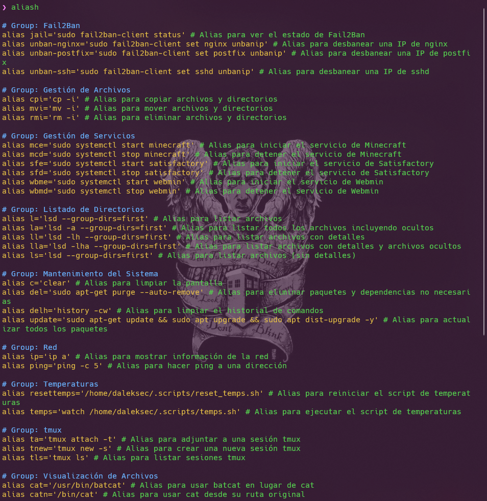

# Configuración Personalizada de `.zshrc`

Este repositorio contiene un archivo `.zshrc` personalizado configurado para usar **Oh My Zsh** con el tema **Powerlevel10k**. Esta configuración mejora tu experiencia en la terminal en Ubuntu con elementos visuales avanzados e incluye una función única para gestionar alias.

## Vista Previa



## Características

- **Oh My Zsh:** Un renderizador de prompts que proporciona un prompt hermoso y personalizable.
- **Powerlevel10k:** Un tema para Oh My Zsh que ofrece un prompt rápido y rico en funciones con elementos visuales avanzados.
- **Gestión de Alias:** Una configuración personalizada que te permite ver todos los alias definidos y sus descripciones ejecutando el comando `aliash`.

## Instrucciones de Instalación

1. **Instalar Zsh:**
   - Asegúrate de que Zsh esté instalado en tu sistema. Si no está instalado, puedes hacerlo con:
     ```bash
     sudo apt update
     sudo apt install zsh
     ```

2. **Descarga e Instala Oh My Zsh:**
   - Sigue las instrucciones de instalación de Oh My Zsh en la [documentación oficial](https://ohmyz.sh/).

3. **Instala el Tema Powerlevel10k:**
   - Sigue las [instrucciones de instalación de Powerlevel10k](https://github.com/romkatv/powerlevel10k#oh-my-zsh) para configurar el tema.

4. **Aplica la Configuración Personalizada de `.zshrc`:**
   - Copia el archivo `.zshrc` desde este repositorio a tu directorio personal:
     ```bash
     curl -L https://raw.githubusercontent.com/jonatanfp-dev/custom-zshrc/master/.zshrc -o ~/.zshrc
     ```
   - Reinicia tu terminal o aplica los cambios con:
     ```bash
     source ~/.zshrc o omz reload
     ```

5. **Uso de la Función de Alias:**
   - Después de instalar el archivo `.zshrc`, puedes ver todos los alias definidos y sus descripciones ejecutando:
     ```bash
     aliash
     ```

6. **Personalización Adicional:**
   - Puedes añadir o eliminar plugins y comandos según tus necesidades en el archivo `.zshrc`.

7. **Notas Adicionales:**
   - Si experimentas problemas o necesitas revertir a tu configuración anterior, puedes restaurar tu copia de seguridad con:
     ```bash
     mv ~/.zshrc.backup ~/.zshrc
     ```

   - Para más información sobre Oh My Zsh y Powerlevel10k, consulta su documentación:
     - [Documentación de Oh My Zsh](https://github.com/ohmyzsh/ohmyzsh/wiki)
     - [Documentación de Powerlevel10k](https://github.com/romkatv/powerlevel10k)

¡Disfruta de tu experiencia mejorada en la terminal!
