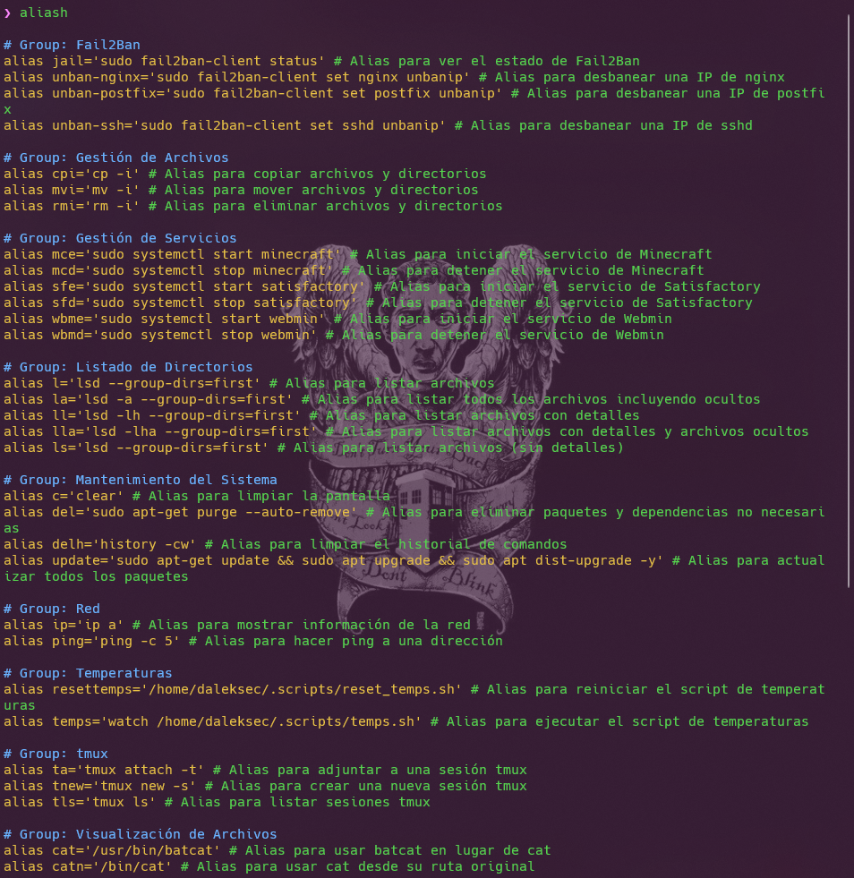

# Custom `.zshrc` Configuration

This repository contains a custom `.zshrc` file configured to use **Oh My Zsh** with the **Powerlevel10k** theme. This configuration enhances your terminal experience on Ubuntu with advanced visual elements and includes a unique feature for managing aliases.

## Preview



## Features

- **Oh My Zsh:** A prompt renderer that provides a beautiful and customizable command prompt.
- **Powerlevel10k:** A theme for Oh My Zsh that offers a fast and feature-rich prompt with advanced visual elements.
- **Alias Management:** A custom setup that allows you to view all defined aliases and their descriptions by executing the `aliash` command.

## Installation Instructions

1. **Install Zsh:**
   - Ensure that Zsh is installed on your system. If not, you can install it with:
     ```bash
     sudo apt update
     sudo apt install zsh
     ```

2. **Download and Install Oh My Zsh:**
   - Follow the installation instructions for Oh My Zsh from the [official documentation](https://ohmyz.sh/).

3. **Install Powerlevel10k Theme:**
   - Follow the [Powerlevel10k installation instructions](https://github.com/romkatv/powerlevel10k#oh-my-zsh) to set up the theme.

4. **Apply the Custom `.zshrc` Configuration:**
   - Copy the `.zshrc` file from this repository to your home directory:
     ```bash
     curl -L https://raw.githubusercontent.com/jonatanfp-dev/custom-zshrc/master/.zshrc -o ~/.zshrc
     ```
   - Restart your terminal or source the `.zshrc` file to apply the changes:
     ```bash
     source ~/.zshrc or omz reload
     ```

5. **Using the Alias Feature:**
   - After installing the `.zshrc` file, you can view all defined aliases and their descriptions by running:
     ```bash
     aliash
     ```

6. **Additional Customization:**
   - Feel free to add or remove plugins and commands as needed in the `.zshrc` file.

7. **Additional Notes:**
   - If you experience any issues or need to revert to your previous configuration, you can restore your backup with:
     ```bash
     mv ~/.zshrc.backup ~/.zshrc
     ```

   - For more information on Oh My Zsh and Powerlevel10k, check out their respective documentation:
     - [Oh My Zsh Documentation](https://github.com/ohmyzsh/ohmyzsh/wiki)
     - [Powerlevel10k Documentation](https://github.com/romkatv/powerlevel10k)

Enjoy your enhanced terminal experience!